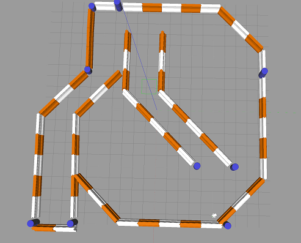

# RoboND Localization Project: Where am I?



## Overview

- Building a mobile robot for simulated tasks.

- Creating a ROS package that launches a custom robot model in a Gazebo world and utilizes packages like AMCL and the Navigation Stack.

- Exploring, adding, and tuning specific parameters corresponding to each package to achieve the best possible localization results.

## Dependencies

```
$ sudo apt-get install ros-kinetic-gazebo-ros-pkgs ros-kinetic-gazebo-ros-control
$ sudo apt-get install ros-kinetic-navigation
$ sudo apt-get install ros-kinetic-map-server
$ sudo apt-get install ros-kinetic-move-base
$ rospack profile
$ sudo apt-get install ros-kinetic-amcl
```
