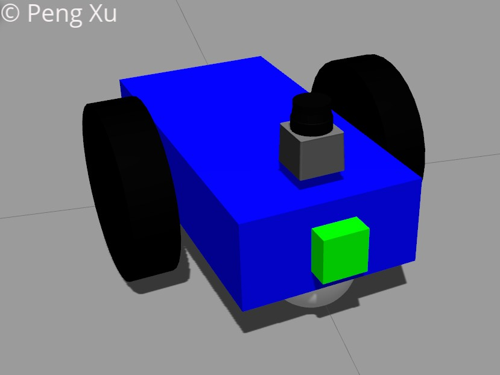
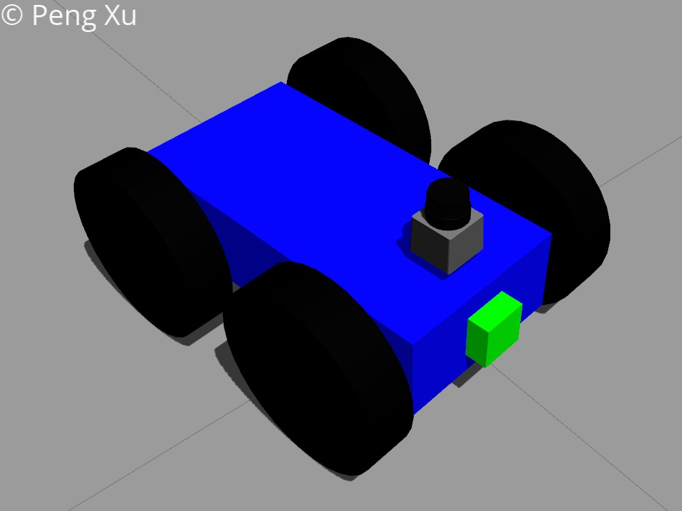
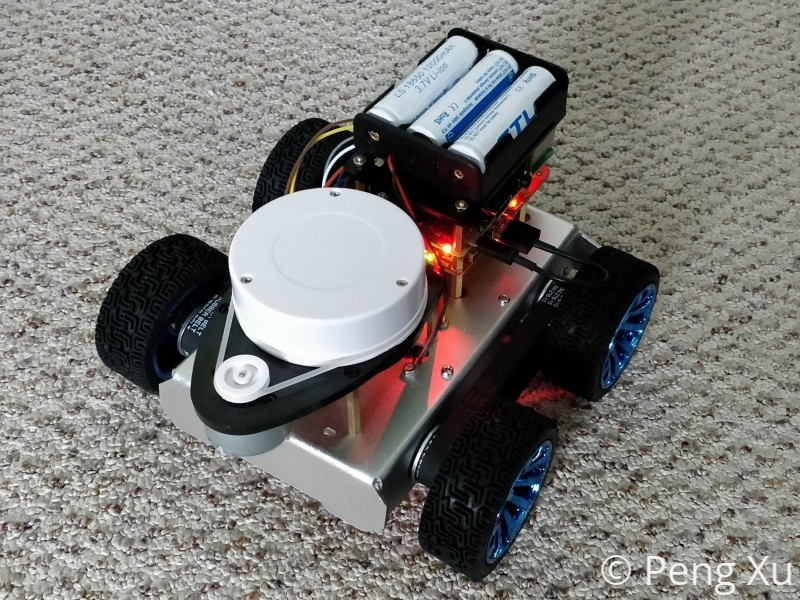

# RoboND Localization Project: Where am I?


An indoor robot localization problem was investigated with two customized robots built in Gazebo. The robots were built from scratch and defined in urdf format. A differential controlled 2-wheel robot model was built from scratch and a skid steer 4-wheel robot was built based on the 2-wheel robot model. Both models were attached with Odometry, Lidar and camera sensors, which were reliable for localization applications. ROS and Rviz were used to control and visualize the localization and navigation experiments. The results indicated the localization in both cases were effective.







More detailed information could be found in the [writeup](writeup.pdf).

## Goals

- Building a mobile robot for simulated tasks.

- Creating a ROS package that launches a custom robot model in a Gazebo world and utilizes packages like AMCL and the Navigation Stack.

- Exploring, adding, and tuning specific parameters corresponding to each package to achieve the best possible localization results.

## Dependencies

```
$ sudo apt-get install ros-kinetic-gazebo-ros-pkgs ros-kinetic-gazebo-ros-control
$ sudo apt-get install ros-kinetic-navigation
$ sudo apt-get install ros-kinetic-map-server
$ sudo apt-get install ros-kinetic-move-base
$ rospack profile
$ sudo apt-get install ros-kinetic-amcl
```
## Instruction

Clone the packages to the catkin workspace:

```
$ mkdir -p ~/catkin_ws/src
$ cd ~/catkin_ws/src
$ git clone https://github.com/xpharry/robond-localization-project.git
```

Build the project:

```
$ cd ~/catkin_ws
$ catkin_make
```

Source the terminal:

```
$ source ~/catkin_ws/devel/setup.bash
```

To run the program:

```
$ roslaunch rover_bot udacity_world.launch
$ roslaunch rover_bot amcl.launch
$ rosrun rover_bot rover_navigation_goal
```

## Reference

- [Tutorial: Using Gazebo plugins with ROS](http://gazebosim.org/tutorials?tut=ros_gzplugins)
- [ROS Navigation Tuning Guide - Kaiyu Zheng](http://kaiyuzheng.me/documents/navguide.pdf)
